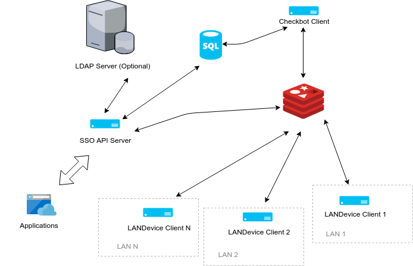

# StarStudioSSO

工作室内部的单点登陆（SSO）服务，供工作室内部系统（包括但不限于签到系统、PaaS容器平台）做身份认证使用。预计使用JWT(Json Web Token)规范。

---

### API 文档 (Documentation)

具体的使用方法可参考 [API 文档](api.md)

---

### 子项目

- **[StarMember](#starmember)**
- **[LANDevice](#landevice)**
- [**CheckBot**](#checkbot)




---

### Docker 部署

#### 构建

```bash
sudo ./docker-build-sso.sh           // 构建 SSO API Server 镜像
sudo ./docker-build-landevice.sh     // 构建 LANDevice 镜像
sudo ./docker-build-checkbot.sh      // 构建 Checkbot 镜像
```

#### 部署 API Server

```bash
docker run --restart always -d -e REDIS_HOST=... \
        -e MYSQL_HOST=... \
        -e MYSQL_PASSWORD=... \
        -e MYSQL_DB=... \
        -e MYSQL_USER=... \
        -e SERVER_HOST_NAME=sso.starstudio.org \
        -p 8000:80 \
        -v /home/www/StarSSO/conf:/etc/StarSSO \
        -v /home/www/StarSSO/log:/var/log/StarSSO \
        starsso:1.0.1
```

#### 部署 LANDevice

```bash
docker run --restart always -d --network host \
    	-e REDIS_HOST=... \
    	-e MONITOR_INTERFACE=...\
        -v /home/www/landevice/conf:/etc/LANDevice \
        -v /home/www/landevice/log:/var/log/LANDevice \
        landevice:1.0.1
```

#### 部署 CheckBot

```bash
docker run --restart always -d -e REDIS_HOST=... \
        -e MYSQL_HOST=... \
        -e MYSQL_PASSWORD=... \
        -e MYSQL_DB=... \
        -e MYSQL_USER=... \
        -v /home/www/CheckBot/conf:/etc/CheckBot \
        -v /home/www/CheckBot/log:/var/log/CheckBot \
        checkbot:1.0.1
```

---

### StarMember

身份管理、认证服务器，支持单点登录，提供Restful API。

#### 依赖

推荐使用 virtualenv 进行部署，在虚拟环境中安装依赖。

```bash
pip install -r requirements.txt
```

#### 配置

在环境变量 API_CFG 指定配置文件位置。

```bash
export LAN_DEV_PROBER_CONFIG=<配置文件绝对路径>
```

##### 配置说明

生产环境请使用 gunicorn 部署，以保证性能。


### LANDevice

设备感知服务，主动感知局域网内在线设备，提供子网内设备信息列表（MAC、IP、设备名等信息），并产生设备活动事件（加入、移除、设备名更新、DHCP重分配等事件），供其他服务使用。所有信息经过 Redis 实现订阅/发布。


#### 依赖

推荐使用 virtualenv 进行部署，在虚拟环境中安装依赖。

```bash
pip install -r requirements_landevice.txt
```

#### 配置

在环境变量 LAN_DEV_PROBER_CONFIG 指定配置文件位置。

```bash
export LAN_DEV_PROBER_CONFIG=<配置文件绝对路径>
```

#### 启动服务

```bash
python -m LANDevice
```

会阻塞，生产环境建议使用supervisor。


### CheckBot 

人员统计服务，结合设备绑定信息，自动统计成员进出情况。


#### 依赖

推荐使用 virtualenv 进行部署，在虚拟环境中安装依赖。

```bash
pip install -r requirements_checkbot.txt
```

#### 配置

在环境变量 CHECK_BOT_CONFIG 指定配置文件位置。

```bash
export CHECK_BOT_CONFIG=<配置文件绝对路径>
```

---

### 配置示例

三个项目的配置都类似，可以共用一个配置文件

```python
#
#   Configure SSO API Server
#

# Logging
ACCESS_LOG = 'access.log'                   # 日志文件
ERROR_LOG = 'error.log'
DEBUG_LOG = 'debug.log'

DEBUG = False                               # 调试模式


# Secret
SECRET_KEY_FILE = 'jwt.pri'                 # JWT 私钥
SECRET_KEY_FILE_MODE = 0o600                # 私钥文件权限
PUBLIC_KEY_FILE = 'jwt.pub'                 # JWT 公钥
PUBLIC_KEY_MODE = 0o666                     # 公钥文件权限

SALT_FILE = 'starstudio.salt'               # 密码散列盐
SALT_FILE_MODE = 0o600                      # 文件权限

AUTH_TOKEN_EXPIRE_DEFAULT = 86400           # Auth 类型 Token 的有效时间 (秒)
APP_TOKEN_EXPIRE_DEFAULT = 86400            # Application 类型 Token 的有效时间 (秒)

# Database
MYSQL_DATABASE_HOST = 'localhost'           # 数据库配置
MYSQL_DATABASE_PORT = 3306
MYSQL_DATABASE_USER = 'root'
MYSQL_DATABASE_PASSWORD = None
MYSQL_DATABASE_DB = 'starstudio'
MYSQL_DATABASE_CHARSET = 'utf8'

# Access contaol                            # 权限控制
ALLOW_REGISTER = True                       # 允许外部注册
ALLOW_ANONYMOUS_GROUP_INFO = True           # 允许匿名访问小组信息，以方便注册

USER_INITIAL_ACCESS = frozenset([
    'auth', 'read_self', 'read_internal', 'read_other', 'write_self', 'read_group'
])

APP_INITIAL_ACCESS = frozenset([
    'auth', 'read_self'
])


# Web console
SSO_WEB_REDIRECT_PREFIX = 'http://sso.local.com/'  # 内部 SSO 管理面板登录的Redirect前缀

#
#   LAN Device discover service.
#   CheckBot service.
#
LAN_DEV_REDIS_HOST = ''                                   # Redis
LAN_DEV_REDIS_PORT = ''
LAN_DEV_REDIS_PROBER_IDENT_PREFIX = 'LANDEV_DEFAULT'      # Redis key前缀，用于区分应用
LAN_DEV_LIVENESS_TRACK_INTERVAL = 5                       # 进行设备存活测试的时间间隔
LAN_DEV_LIVENESS_PROBE_TIMEOUT = 5                        # 进行设备发现超时时间
                                                          # 若设备在此时间内无响应，则判断
                                                          # 设备不存在
LAN_DEV_LIVENESS_PROBE_INTERVAL = 30                      # 进行设备发现的时间间隔
LAN_DEV_INTERFACE = 'wlp3s0'                              # 进行设备感知的接口名称
```

